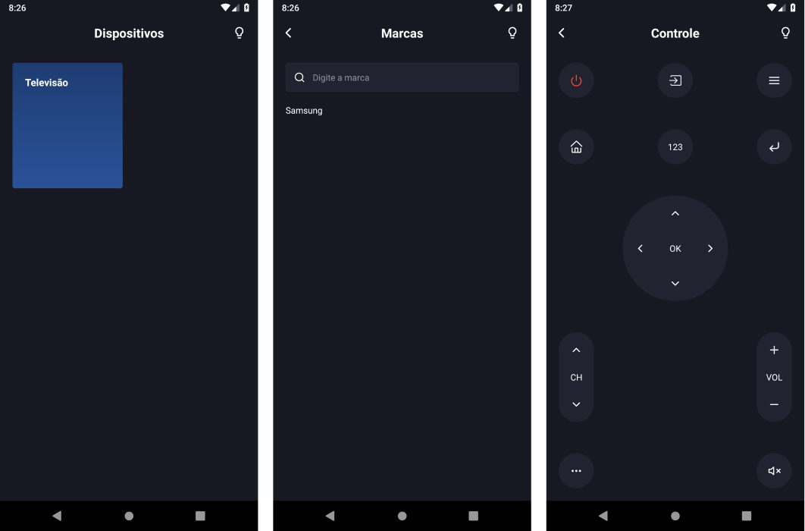

<h1 align="center">
  
</h1>

<blockquote align="center">:metal: Remote control with React Native</blockquote>

  

## Installer

[Android .apk installer](https://drive.google.com)

## Getting started

### Prerequisites

- You'll need to run the backend server, see this [instructions]().

### Installing

- Clone this repo (`git clone git@github.com:marcosabb/controlae-mobile.git`)
- Install dependencies (`yarn`)
- Create a `.env` file and copy and paste the content of `.env.example` file
- Install app on android device or emulator (`yarn android`)
- Start app (`yarn start`)

## Contribute

- Fork this repo (`git clone git@github.com:marcosabb/controlae-mobile.git`)
- Create a new branch (`git checkout -b feature/awesome-feature`)
- Commit your changes (`git commit -a`)
- Push to the branch (`git push origin feature/awesome-feature`)
- Create a pull request

If you want add a new device, open a issue with device type (e.g: tv), and brand.

## License

This project is licensed under the MIT License - see the [LICENSE.md](LICENSE.md) file for details.
